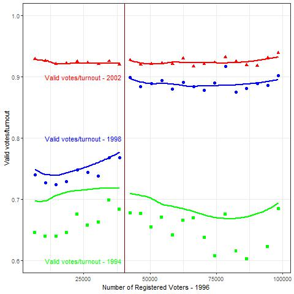
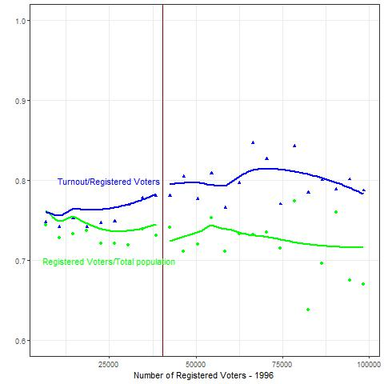

# Replicação - Fujiwara (2015)

## Introdução

Exercício de replicação em linguagem R de alguns dos principais resultados do artigo "VOTING TECHNOLOGY, POLITICAL RESPONSIVENESS, AND INFANT HEALTH: EVIDENCE FROM BRAZIL" de Thomas Fujiwara, publicado em 2015 pela Econometrica.

## Outputs

Abaixo temos gráficos semelhantes as figuras 2 e 3 do artigo:

